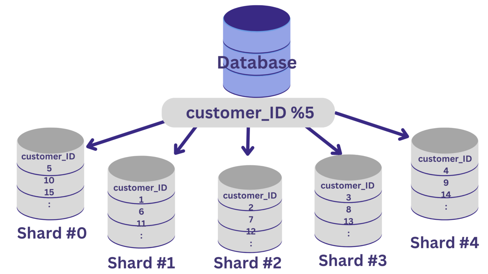

# Database Sharding Implementation Guide

## Table of Contents
- [Introduction to Sharding](#introduction-to-sharding)
- [When to Consider Sharding](#when-to-consider-sharding)
- [Sharding Strategies](#sharding-strategies)
- [Sharding Architecture](#sharding-architecture)
- [Implementation Approaches](#implementation-approaches)
- [Challenges and Considerations](#challenges-and-considerations)
- [Monitoring and Maintenance](#monitoring-and-maintenance)
- [Examples of Sharding Implementations](#examples-of-sharding-implementations)
- [References](#references)

## Introduction to Sharding

Database sharding is a horizontal partitioning technique that breaks a large database into smaller, more manageable pieces called shards. Each shard contains a distinct subset of the data and operates as an independent database instance, often distributed across different physical servers or cloud instances.

### Key Concepts

- **Horizontal Partitioning**: Unlike vertical partitioning (which splits tables by columns), sharding divides tables by rows across multiple database instances.
- **Distributed Architecture**: Shards are typically distributed across multiple servers to distribute load and improve performance.
- **Data Isolation**: Each shard contains a complete subset of data with the same schema as the original database.

## When to Consider Sharding

Sharding is particularly beneficial in the following scenarios:

- **High Throughput Requirements**: Applications that need to handle thousands or millions of operations per second.
- **Large Datasets**: When your dataset grows beyond what a single database server can efficiently manage.
- **Geographic Distribution**: Applications serving users across different regions may benefit from local data access.
- **High Availability Requirements**: By distributing data across multiple servers, you can reduce single points of failure.

## Sharding Strategies

### Range-Based Sharding

Data is partitioned based on ranges of a key value.

```
Shard 1: Customer IDs 1-10,000
Shard 2: Customer IDs 10,001-20,000
Shard 3: Customer IDs 20,001-30,000
```

**Pros**: Simple to implement, good for sequential access patterns.  
**Cons**: Potential for uneven data distribution (hotspots).

### Hash-Based Sharding

A hash function determines the shard for each record.

```
Shard = hash(sharding_key) % number_of_shards
```

**Pros**: Distributes data more evenly, reduces hotspots.  
**Cons**: Rebalancing data when adding shards is complex.

### Directory-Based Sharding

Uses a lookup service to map data to specific shards.

**Pros**: Highly flexible, supports complex sharding logic.  
**Cons**: The lookup service can become a bottleneck or single point of failure.

### Geographically-Based Sharding

Distributes data based on geographic location.

**Pros**: Reduces latency for regional users.  
**Cons**: Handling users who travel or access from different locations.

## Sharding Architecture

### Components of a Sharded Database System

1. **Shard Manager**: Handles shard location and routing logic.
2. **Query Router**: Directs queries to appropriate shards.
3. **Metadata Database**: Stores information about which data resides on which shard.
4. **Shards**: Individual database instances containing partitioned data.

### Architectural Patterns

#### Shared-Nothing Architecture

Each shard operates independently with its own CPU, memory, and storage.

#### Coordinator-Based Architecture

A central coordinator manages transactions and queries across shards.

#### Federated Architecture

A middleware layer abstracts the sharding complexity from the application.

## Implementation Approaches

### Application-Level Sharding

The application contains the logic to determine which shard to query.

```python
def get_shard_for_customer(customer_id):
    return customer_id % NUMBER_OF_SHARDS

def get_customer_data(customer_id):
    shard = get_shard_for_customer(customer_id)
    return db_connections[shard].query("SELECT * FROM customers WHERE id = ?", customer_id)
```

**Pros**: Full control over sharding logic.  
**Cons**: Increases application complexity.

### Framework/Middleware Sharding

Uses a framework or middleware to handle sharding logic.

**Pros**: Separates sharding concerns from application code.  
**Cons**: Potential performance overhead, limited customization.

### Database-Native Sharding

Uses database systems with built-in sharding capabilities (e.g., MongoDB, PostgreSQL with table partitioning).

**Pros**: Leverages optimized database features.  
**Cons**: Vendor lock-in, limited to database's sharding capabilities.

## Challenges and Considerations

### Data Consistency

Maintaining consistency across shards can be challenging, especially for cross-shard operations.

### Joins and Aggregations

Cross-shard joins are typically expensive. Consider denormalizing data or implementing map-reduce operations.

### Rebalancing

As data grows unevenly, redistributing data across shards becomes necessary but can be complex.

### Schema Changes

Coordinating schema changes across multiple shards requires careful planning.

### Transaction Management

Cross-shard transactions are complex and often require distributed transaction protocols.

## Monitoring and Maintenance

### Key Metrics to Monitor

- Query performance per shard
- Shard size and growth rates
- Cross-shard operation frequency
- Rebalance operations and timing

### Maintenance Operations

- Shard rebalancing procedures
- Backup and recovery strategies
- Consistency checking across shards
- Upgrading database versions

## Examples of Sharding Implementations

### MongoDB Sharding

MongoDB uses a three-component architecture:
- **Shards**: Store the data
- **Config Servers**: Store metadata about shard distribution
- **Mongos**: Query routers that direct operations to the appropriate shard

### MySQL Sharding

Custom sharding strategies include:
- MySQL Cluster
- MySQL Fabric
- ProxySQL
- Vitess (YouTube's sharding solution for MySQL)

### PostgreSQL Sharding

Options include:
- Built-in table partitioning
- Citus extension for distributed PostgreSQL
- PgShard
- pg_shard

## References

- "Database Internals" by Alex Petrov
- "Designing Data-Intensive Applications" by Martin Kleppmann
- "High Performance MySQL" by Baron Schwartz, et al.
- MongoDB Documentation on Sharding Architecture
- PostgreSQL Documentation on Partitioning

## Contributing

We welcome contributions to this sharding database implementation guide. Please see [CONTRIBUTING.md](CONTRIBUTING.md) for details.

## License

This project is licensed under the MIT License - see the [LICENSE](LICENSE) file for details.