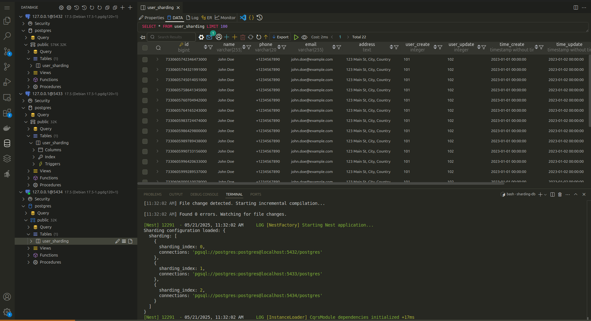

# Sharding Database

## What is Sharding Database
Sharding is a database architecture pattern that involves splitting a large database into smaller, more manageable pieces called shards. Each shard is an independent database that contains a subset of the data, typically distributed based on a specific key such as user ID or geographic region.

## Use Case of It
- Applications with high traffic and large datasets.
- Systems requiring horizontal scalability to handle growing data volumes.
- Multi-tenant applications where data isolation is necessary.
- Geographically distributed systems to reduce latency by storing data closer to users.

## Pros and Cons

### Pros
- **Scalability**: Enables horizontal scaling by distributing data across multiple servers.
- **Performance**: Reduces query load on individual shards, improving response times.
- **Fault Isolation**: Issues in one shard do not affect others.
- **Cost Efficiency**: Allows the use of smaller, less expensive servers.

### Cons
- **Complexity**: Increases the complexity of database management and application logic.
- **Data Distribution**: Requires careful planning to avoid uneven data distribution.
- **Cross-Shard Queries**: Queries spanning multiple shards can be slower and more complex.
- **Maintenance**: Adding or removing shards requires significant effort.

## Alternative
- **Replication**: Duplicating the entire database across multiple servers for redundancy and load balancing.
- **Partitioning**: Dividing a single database into smaller, logical partitions without creating separate databases.
- **Caching**: Using in-memory caches like Redis to reduce database load.

## Implementations

- **PostgreSQL**: Using table inheritance or foreign data wrappers for sharding.
- **MongoDB**: Built-in sharding support with configurable shard keys.
- **MySQL**: Proxy-based solutions like Vitess or custom application-level sharding.
- **Custom Implementation**: Using libraries or frameworks like `@nestjs/cqrs` for command and query segregation, as demonstrated in the provided TypeScript code.